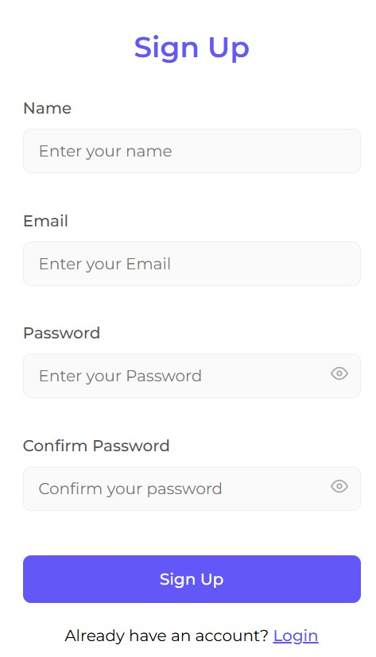
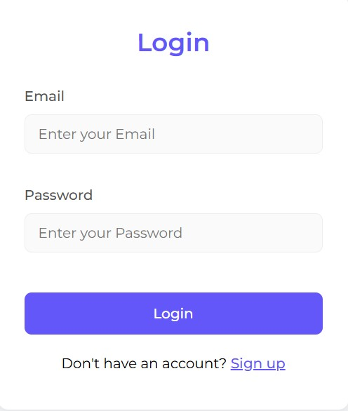
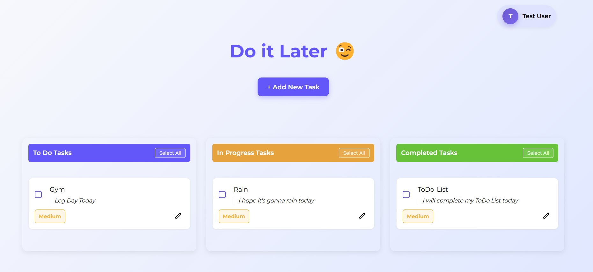
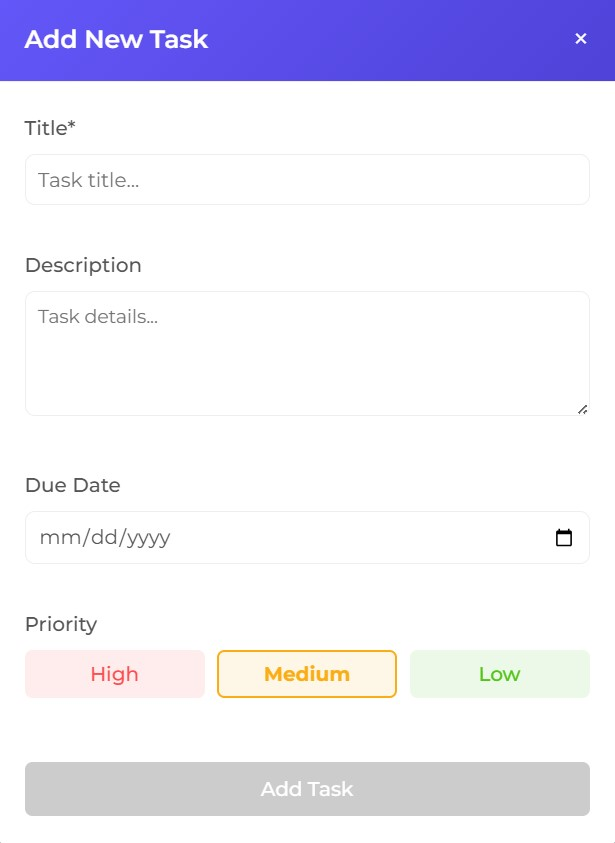
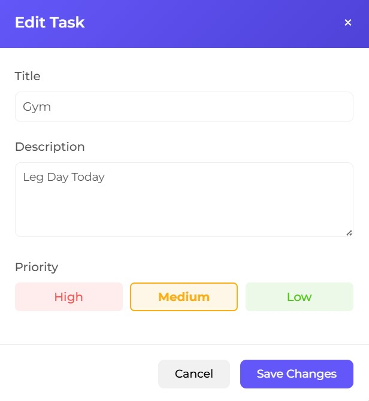
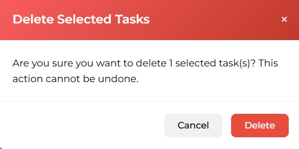
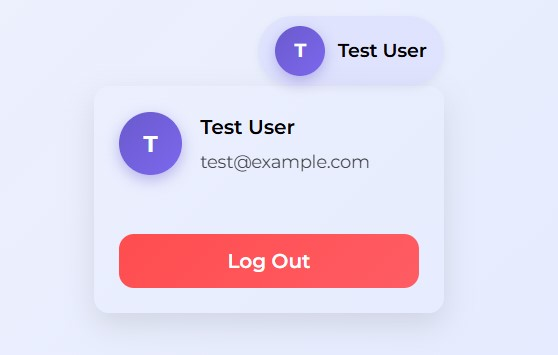
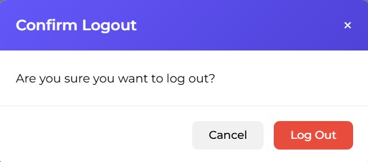

# 🧠 Do It Later – Task Manager App

> A beautifully crafted task management web app built with React, Redux, and SCSS for managing daily tasks, editing, deleting, prioritizing, and organizing your workflow like a beast.


---

## ✅ Features

- 🔐 **Authentication**: Sign up & login using secure localStorage
- 📝 **Create Tasks**: Add new tasks with title, description, and priority
- 🛠 **Edit Tasks**: Inline editing modal to update your task
- 🗑 **Delete Tasks**: Delete individual or multiple selected tasks
- 📦 **Drag and Drop**: Move tasks across columns (To Do → Doing → Done)
- 🎨 **Priority Tags**: Colored tags (high, medium, low)
- 🧠 **Persistent State**: Saves tasks per user using Redux + localStorage
- 🎉 **Confetti**: Celebration when tasks are completed!
- 🚀 **Fully Responsive**: Looks great on desktop and mobile
- 💬 **Toast Notifications**: Real-time feedback using `react-hot-toast`

---

## 📸 Screenshots
| Feature | Screenshot |
|---------|-----------|
| **Register** |  |
| **Login** |  |
| **HomePage** |  |
| **Add New Task** |  |
| **Edit Modal** |  |
| **Delete Modal** |  |
| **User DropDown** |  |
| **Logout Modal** |  |

---

## ⚙️ Tech Stack

- **Frontend**: React, Redux Toolkit
- **Styling**: SCSS (modular with variables, mixins, and main styles)
- **Routing**: React Router
- **Notifications**: `react-hot-toast`
- **Confetti**: `canvas-confetti`
- **Form UX**: Fully accessible and keyboard friendly

---

## 🛠️ Installation 

1. **Clone the repository:**
   ```bash
   git clone https://github.com/BinayRajThapa/Do-it-Later.git

2. **Navigate to the project directory:**
   ```bash
   cd Do-IT-Later

3. **Install the required dependencies:**
   ```bash
   npm install

3. **Run the app:**
   ```bash
   npm run dev

---

## 📜 Upcoming Improvements

- 🌑 Add dark/light theme toggle
- 📆 Due dates for tasks
- 🔍 Search and filter by title/priority
- 📱 PWA support
- 🔌 Connect to backend for real-time data persistence


## Contributing 🤝
Contributions are welcome! If you have any suggestions, bug reports, or feature requests, please open an issue or submit a pull request.